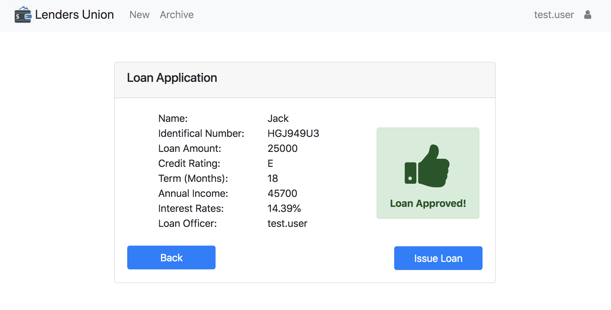

# Loan Management System

A web application built using Angular for a fictional loan company Utilizing this app, staff will be able to submit customer loans application for interest rate calculations and approval. 

[Demo](https://loanmanagementsystem.herokuapp.com)

## Getting Started

1. Install the Angular CLI

    `npm install -g @angular/cli`

1. Run `npm install`

1. Run `ng serve -o`